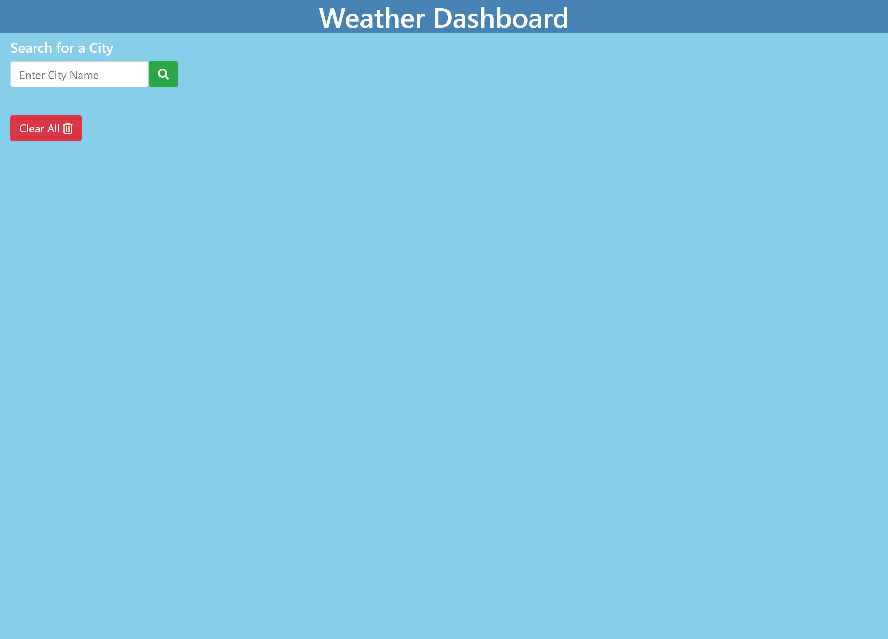

# Weather-Dashboard

## Description

Developers are often tasked with retrieving data from another application's API and using it in the context of their own. Third-party APIs allow developers to access their data and functionality by making requests with specific parameters to a URL. 

Our challenge this week is to build a weather dashboard that will run in the browser and feature dynamically updated HTML and CSS. Using the [OpenWeather API](https://openweathermap.org/api) to retrieve weather data for cities and also using `localStorage` to store any persistent data.

## User Story

```
AS A traveler
I WANT to see the weather outlook for multiple cities
SO THAT I can plan a trip accordingly
```

## Tasks Completed

    1. Created index.html, script.js, and style.css files.

    2. Created input form for user to be able to type in city name they wish to search.

    3. Created function for weather for city searched to be displayed on webpage with dynamically created elements.

    4. Used OpenWeather API in order to get Daily Forecast, 5 Day Forecast, UV Index, & Icon Represenation of Weather Conditions.

    5. Created separate function for 5 Day Weather Forecast to be displayed. 

    6. Created separate function for UV Index to be displayed.

    7. Created function for dates to be displayed.

    8. Created function to save city search history to local storage and for user to get weather for previously searched cities by clicking on them. 

    9. Created if statement to show the last searched city forecast when user reopens the weather dashboard. 

## Link to Deployed Application & ScreenShots of Completed Application

**Live Link** 
[Weather Dashboard](https://dspark8916.github.io/Weather-Dashboard/)

**ScreenShots**
    



